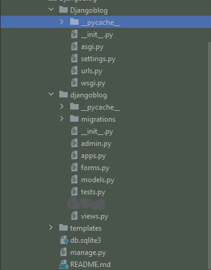
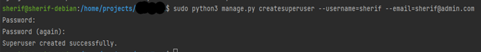
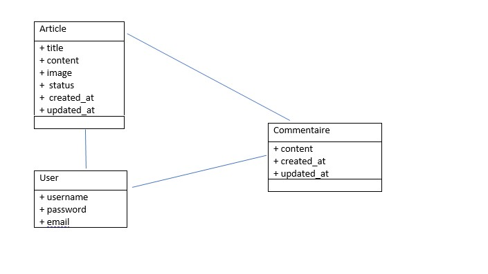
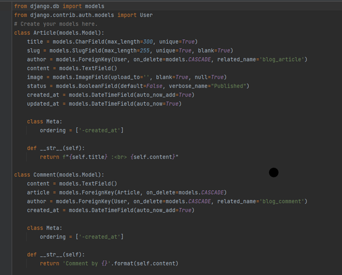
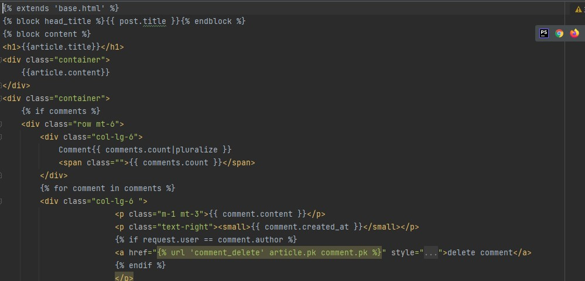

# Simplicity is the way 👍 : PRÉAMBULE

En tant qu&#39;habitué PHP, de mon point de vue, il est difficile de ne pas aimer Django. Il respecte bien la logique du pattern MVT et l&#39;impression est celle d&#39;être allégé dans le dév. Vous n&#39;aurez plus à gérer le contrôleur par exemple, car simplement il n&#39;y en a pas.

MVC VS MVT

Modèle Vue Template, le Django est un langage basé sur ce patron de conception, ou, design pattern pour les puristes.

comparé à des &#39;cousines&#39; technos basées sur PHP, comme Symfony, Django est un framework &#39;New School&#39;, du moins on peut le considérer tel.

L&#39;architecture est épurée, dans le même principe que la syntaxe de Python… Ça fait toujours plaisir et idéal pour mettre rapidement au point un petit projet 😉.

Il faut avouer cependant que la communauté Python-Django ne semble pas aussi importante que la communauté PHP-Symfony ou même Laravel.

Même si au niveau de la documentation par exemple, les deux frameworks se valent pour moi.

# 1 Installation et prise en main

L&#39;un des prérequis pour installer Django est avoir Python et le gestionnaire de paquets « Pip » dans son système. Puis lancer la commande :

```sh

$ python3 -m pip install Django

```

Ceci fait, je veux créer mon projet et les fichiers qui vont avec ; je le nommé « Djangoblog »

```sh

$ python3 -m django startproject Djangoblog

```

La structure de base du projet est la suivante




# 2 Environnement virtuel et built-in serveur

L&#39;environnement virtuel a pour but de manager nos dépendances sans conflit, la création de ce dernier est fortement conseillée par la doc.

Je lance les commandes qui suivent pour créer un « virual environment », avec comme nom « br-mvc-venv ».

```sh

$ python3 -m venv br-mvc-venv

```

Activer l&#39;environnement virtuel.

```sh
$ source br-mvc-venv/bin/activate
```


## 3 AUTH

Je crée un premier utilisateur avec rôle admin, L&#39;outil en ligne de commande nous demandera de choisir un mot de passe
```sh
$ python3 manage.py createsuperuser --username=admin --email=admin@admin.com
```
<div style="width: 100%">


</div>

## 4 Modèle de données, mapping, pérsistence

Sur la base du diagramme qui suit, je crée le modèle de données pour mon application.



Django permet de décrire la structure de notre base de données avec du code Python (fichier models.py). Il est livré avec un mapping objet-relationnel avec lequel nous pouvons créer nos tables automatiquement.

La [syntaxe de modélisation des données](https://docs.djangoproject.com/fr/4.0/topics/db/models/) offre un moyen pratique de représenter nos modèles.

<div style="width: 50%">


</div>

## Déployer le modèle

Mon but étant de créer automatiquement le fichier pour les migrations et les tables de la base de données, je lance les commandes:

```sh

$ python manage.py makemigrations

$ python manage.py migrate

```

## 5 Vues, URLS et templates 

VUES

Notre vue récupère des données d&#39;après les paramètres, charge un template et affiche le template avec les données récupérées.

Les classes suivantes dont je me suis servi pour le projet fournissent une base pour l&#39;édition de contenu, le traitement des formulaires :

- [**django.views.generic.edit.FormView**](https://docs.djangoproject.com/fr/4.0/ref/class-based-views/generic-editing/#django.views.generic.edit.FormView)
- [**django.views.generic.edit.CreateView**](https://docs.djangoproject.com/fr/4.0/ref/class-based-views/generic-editing/#django.views.generic.edit.CreateView)
- [**django.views.generic.edit.UpdateView**](https://docs.djangoproject.com/fr/4.0/ref/class-based-views/generic-editing/#django.views.generic.edit.UpdateView)
- [**django.views.generic.edit.DeleteView**](https://docs.djangoproject.com/fr/4.0/ref/class-based-views/generic-editing/#django.views.generic.edit.DeleteView)

La doc indique clairement que chaque vue est responsable soit de retourner un objet [**HttpResponse**](https://docs.djangoproject.com/fr/4.0/ref/request-response/#django.http.HttpResponse) contenant le contenu de la page demandée, ou soit lever une exception, comme par exemple [**Http404**](https://docs.djangoproject.com/fr/4.0/topics/http/views/#django.http.Http404).

URLS

Django permet la conception de belles URL et ne place aucune extension dans celles-ci, comme  **.php**  ou  **.asp**.

Les notations < int:pk> permettent de router notre application et faire correspondre un zero ou un autre nombre entier positif.

<div style="width: 100%">


</div>

TEMPLATES

<div style="width: 100%">



</div>
Les variables sont entourées par deux accolades.  **{{****   ****article.title****   ****}}**  veut dire « Afficher la valeur de l&#39;attribut titre de l&#39;article ». Mais les points ne sont pas utilisés uniquement pour l&#39;utilisation des attributs. Ils peuvent aussi être utilisés pour la recherche des clés de dictionnaires, d&#39;index, ou pour appeler des fonctions.

Enfin, Django utilise le concept d&quot;« héritage de gabarits ». C&#39;est ce que fait  ****. Cela veut dire « Charge premièrement le gabarit nommé &quot;base&quot;, qui a défini certains blocs, et remplit ces blocs avec le contenu qui suit. ». Pour résumer, cela permet de diminuer significativement la redondance dans les gabarits : chaque gabarit ne doit définir que ce qui lui est propre.

#

## Ce fut suave : CONSCLUSION

Ce projet a été plutôt simple et amusant, dans la mesure où la majeure partie des notions que je connaissais grâce à d&#39;autres frameworks étaient toujours d&#39;actualité. J&#39;ai pu donc le prendre en main assez rapidement.

### Je note ce framework à 14/20

#### Points positifs

- Syntaxe claire
- Assez rapide à prendre en main
- Architecture épurée

#### Points Négatifs

- Django fourni des interfaces d&#39;administration, qui ne sont pas forcément utiles pour la petits projets
- La communauté Django est moins importante par rappot à celle d'autres technos.