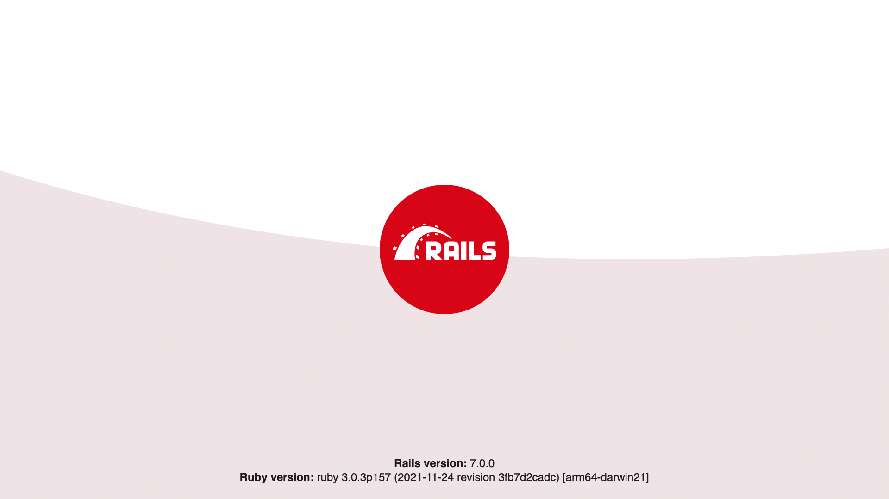

# Ruby Onrails

Salut à toi cher lecteur ou lectrice de ce petit journal de bord de mon aventure sur Ruby onRails. Etant une personne féru de Python et de PHP, je
n'avais jamais touché à une technologie comme Ruby. C'était pour moi une agréable et la fois triste suprise que de me dire que j'allais vraiment devoir de partir de zéro comme un survivant qu'on lâche pratiquement nu dans la nature il fallait réapprendre le code et cette nouvelle façon de coder, ce qui n'as pas été de tous repos.

Mais forcé d'apprendre que cette technologie est une technologie plus que particulière à mes yeux et ayant une syntaxe plus que mystique.
Commençons donc dans le périple de mon aventure Ruby onRails.

## 1. Installation projet et Setup

On avait pour contrainte d'utiliser uniquement la documentation offcielle  [officielle de Ruby OnRails](https://guides.rubyonrails.org/getting_started.html).

voyons voir comment on va installer ce fameux Ruby OnRails 

Installons nodeJS comme nous demande la documentation mais pas pour rien celle-ci nous permettera d'utiliser le javascript avec notre projet.
`sudo apt-get install nodejs`

Installons PostgresSQL, que j'affectionne et donc utilisé pour mon petit projet de blog.
`sudo apt-get install postgresql postgresql-contrib`

Configurons notre postgres c'est important :
`createuser -P -s -e adrien`

Parfait on peut ensuite créer notre base de données et tout ce qui s'en suit, installons le plus important c'est à dire Ruby OnRails :
`sudo apt-get install rubygems`
`gem install rails`
Installons la version de postgres avec gem pour Ruby :
`gem install pg`
On peut enfin créer notre projet parfait non ?
`rails new blog --database=postgresql`

Une installation longue est fastidieuse mais rien d'extraordinaire tout va bien le projet est bien créé on peux même le lancer pour tester, rien de plus simple que :
`bin/rails server`

Super le projet run, mais rien de génial 
<div style="width:50%; margin: auto;">



</div>

Configurons la connexion à la base de données 
Pour ce faire rendons nous dans le dossier `/config/database.yml`
Nous allons modifier ces quelques lignes : 

```yml

development:
  <<: *default
  database: blog


test:
  <<: *default
  database: blog_test


production:
  <<: *default
  database: blog
  username: blog-username
  password: blog-password

```
Nous avons bien tout configuré, par conséquent, notre base de données fonctionne parfaitement aisni que :

## 2. Setup mes premières "Models"
#### _On vas créer nos premiers models_

Nous pouvons donc commencer à créer notre base de données afin que celle-ci accueille des données sinon ce n'est pas très marrant :D.
Sur mon jeune framework Ruby Onrails on possède de multiples commandes plus utiles les unes que les autres.
Comment vous dire que c'est à disposition donc autant l'utiliser ahaha !! 
Utilisons la commande : `bin/rails generate model ModelName [columnName:type, columnName:type, ...]`
cette commande que fait elle ? Elle génère des Models ainsi que des migrations et remplis également le fichier schema.rb
Générons mes Models :) 

User :
`bin/rails generate model Users username:string email:string password:string`

Notre migrations ressemble à ceci :
```ruby
class CreateUsers < ActiveRecord::Migration[7.0]
  def change
    create_table :users do |t|
      t.string :email
      t.string :password_digest
      t.string :username

      t.timestamps
    end
  end
end
```
Et notre model ressemble à ceci : 
```ruby
class User < ApplicationRecord
    has_many :comments
    has_many :articles
    # adds virtual attributes for authentication
    has_secure_password
    # validates email
    validates :email, presence: true, uniqueness: true, format: { with: /\A[^@\s]+@[^@\s]+\z/, message: 'Invalid email' }

end

```

Articles:
`bin/rails generate models Articles title:string body:text Users:reference Category:reference`

Notre migrations :
```ruby
class CreateArticles < ActiveRecord::Migration[7.0]
  def change
    create_table :articles do |t|
      t.string :title
      t.text :body

      t.timestamps
    end
  end
end

```

Notre models :
```ruby
class Article < ApplicationRecord
    has_many :comments
    has_one :users
    belong_to :category
    validates :title, presence: true
    validates :body, presence: true, length: { minimum: 10 }
end
```

Category:
`bin/rails generate model Category name:string`

Migration :
```ruby
class CreateCategories < ActiveRecord::Migration[7.0]
  def change
    create_table :categories do |t|
      t.string :name

      t.timestamps
    end
  end
end
```

Model :
```ruby
class Category < ApplicationRecord
    has_many :articles
end
```
Voila comment on a créé un models, rien de bien compliqué me diriez-vous. Néanmoins, détrompez-vous toute la dificulté est dans le jointure lorsque que l'on connait pas les histoires de référence. Mais ruby est bien construit, en effet, une fois prise en mains, une jointure devient aussi facile à faire que d'écrire une simple variable 
`belong_to` -> qui associer un table a une autre et `has_one / has_many` -> qui donne le type de jointure. 

__Générons la database__

On peux à partir de maintenant générer notre base de données, pour ce faire, un nouvelle commande ahah encore une ? Et oui comme je vous ai dit on possède de multiples commandes nous faisaint le travail à notre place.


<div style="width:50%; margin: auto;">


</div>


## 3. Vues, controllers et routing

On va maintenant rentrer dans le vif du sujet, notre routing, nos controllers et nos Views

<div style="display: flex; width: 100%; justify-content: space-evenly;">

<div style="width: 40%">

Il faut avant tout savoir que j'ai lu et relu la documentation qui expliquait la façon de procéder, néanmoins,je me suis vu confronter à une chose déplaisante . Quelle est cette chose me deplaisant tant ? La syntaxe, mais nous en reparlerons plus tard. Nous allons créer nos premières routes afin de naviguer entre les différentes pages, malheuresement pas de commande nous faisant tout le travail pour ce Ruby OnRails.
Mais nous allons aller directement de notre dossier /config/routes.rb.
Les choses serieuses commence, en effet, nous pouvons désormais définir nos routes nous même avec un méthode et un appella à la vue et au controller associé .

```ruby
root "home#index"

  get "/", to: "home#index"
  get 'sign_up', to: 'registrations#new'
  post 'sign_up', to: 'registrations#create'
  get 'sign_in', to: 'sessions#new'
  post 'sign_in', to: 'sessions#create', as: 'log_in'
  delete 'logout', to: 'sessions#destroy'
  get '/member', to: 'member#index'
  get "/category/:id", to: "category#show"
```

Root nos que nous definissons comme première page de notre index en quelque sorte.

Et ruby nous effectue, une nouvelle fois, le travail avec les resources qui permettent de créer les CRUD encore plus rapidement.

```ruby
resources :articles do
    resources :comments
  end
```

on peut bien évidemment imbriquer des resources dans d'autres resources lorsqu'elles sont associées.

</div>


</div>


Passons à la structure même des controllers :
```ruby
class ArticlesController < ApplicationController
  def show
    @article = Article.find(params[:id])
    @user = User.find(@article.users_id)
  end

  def new
    @article = Article.new
    @categorys = Category.all
  end

  def create
    @article = Article.new(article_params)
    

    if @article.save
      redirect_to @article
    else
      render :new, status: :unprocessable_entity
    end
  end

  def edit
    @article = Article.find(params[:id])
  end

  def update
    @article = Article.find(params[:id])

    if @article.update(article_params)
      redirect_to @article
    else
      render :edit, :unprocessable_entity
    end
  end
  
  def destroy
    @article = Article.find(params[:id])
    @article.destroy

    redirect_to root_path, status: :see_other
  end


  private
    def article_params
      users_id = { users_id: Current.user.id }
      params.require(:article).permit(:title, :body, :category_id, :users_id).reverse_merge(users_id)
    end
end

```


```html
<h1>New Article</h1>

<%= form_with model: @article do |form| %>
  <div>
    <%= form.label :title %><br>
    <%= form.text_field :title %>
  </div>
<div>
        <%= form.collection_select(:category_id, Category.all, :id, :name)%>
</div>
  <div>
    <%= form.label :body %><br>
    <%= form.text_area :body %>
  </div>

  <div>
    <%= form.submit %>
  </div>
<% end %>
```


## 4. Les difficultés

Je ne veux plus utiliser ce langage de programation. En effet, celui-ci ne m'a pas plu.

1. MSystème de routing est très complexe que je ne le comprend pas.
   
2. Model compliquer à mettre en place même avec la documentation pour la première fois


## Conclusion 

Ce projet a été plus que complexe avec un démarrage difficile. La documentation étant quant à elle plutôt bien fournie, m'a permis de réaliser diverses tâches ainsi que de pouvoir créer mon projet "Blog".

### Je note ce framework à 12/20


#### Points positifs
- Utilitaire de commandes bien fournis, permettant de réaliser de multiples tâches. Telles que générations de controller, de models, affichage des routes.
- Très peu de lignes de code par controllers. Ce qui rend le traitement des erreurs plus simple et plus rapide.
- Documentations très riche en informations et communautées plutôt active. 


#### Points Négatifs
- Routing pas clairement seulement mon point personnel
- Models reference difficile a prendre en main au début.

