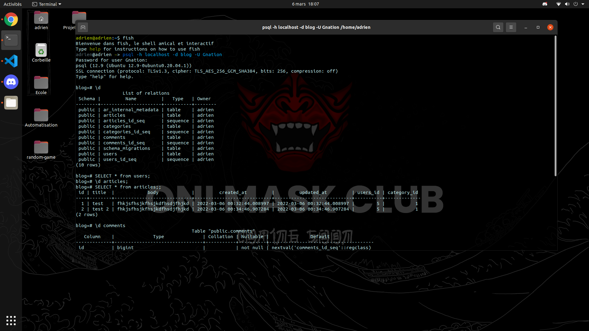

# Ruby OnRails
### Mon terrible périble dans des zones inconnus


## Introduction

Salut à toi chère lecteur ou lectrice de ce petit journal de bord de mon aventure sur Ruby onRails. Etant une personne féru de Python et de PHP, je
n'avais jamais touché à une technologie comme Ruby. C'était pour moi une agréable et la fois triste suprise que de me dire que j'allais vraiment devoir de partir de zéro comme un survivant que l'on lâche pratiquement nu dans la nature il fallait réapprendre le code et cette nouvelle façon de coder ce qui n'as pas été de tous repos honnêtement.

Mais forcement d'apprendre que cette technologie est une technologie plus que particulière a mes yeux et ayant une syntaxe plus que mystique.
Commençons donc d   ans le periple de mon aventure Ruby onRails.

## 1. Installation de Symfony et setup du projet

On avais pour contrainte d'utiliser uniquement la documentation offcielle  [officielle de Ruby OnRails](https://guides.rubyonrails.org/getting_started.html).

voyons voir comment on va installer ce fameux Ruby OnRails 

Installons nodeJS comme nous demande la documentation mais pas pour rien celle-ci nous permettera d'utiliser le javascript avec notre projet.
`sudo apt-get install nodejs`

Installons PostgresSQL, j'aime bien et je l'ai donc utilisé pour mon petit projet de blog.
`sudo apt-get install postgresql postgresql-contrib`

Configurons notre postgres c'est important :
`createuser -P -s -e adrien`

Parfait on peut ensuite créer notre base de données et tous ce qui s'en suis  installons le plus important c'est à dire Ruby OnRails :
`sudo apt-get install rubygems`
`gem install rails`
Installons la version de postgres avec gem pour Ruby :
`gem install pg`
On peut enfin créer notre projet parfait non ?
`rails new blog --database=postgresql`

Une installation longue est fastidieuse mais rien d'extraordinaire tous va bien le projet est bien créer on peux meme le lancer pour tester rien de plus simple que :
`bin/rails server`

Super le projet run mais rien de génial 
<div style="width:50%; margin: auto;">


</div>

Configurons la connexion à la 
Pour ce faire rendons nous dans le dossier `/config/database.yml`
Nous allons modifier c'est quelque ligne : 

```yml

development:
  <<: *default
  database: blog


test:
  <<: *default
  database: blog_test


production:
  <<: *default
  database: blog
  username: blog-username
  password: blog-password

```
On a tous setup Niquel tous ça notre abse de donné fonctionne ainsi que notre 

## 2. Setup mes premières "Models"
#### _On vas créer nos premier models_

Commençon a créer notre base de donnée afin que celle-ci accueille des donnée sinon ce n'est pas très marrant :D.
Sur mon jeune framework Ruby Onrails on possède une tripoter de command plus utilise les une que les autres.
Comment vous dire que c'est a disposition donc autant l'utiliser ahaha !! 
Utilisons la commande : `bin/rails generate model ModelName [columnName:type, columnName:type, ...]`
cette commande que fait elle ? Elle générer des Models ainsi que des migration et un remplis le fichier schema.rb
Générons mes Models :) 

User :
`bin/rails generate model Users username:string email:string password:string`

Notre migrations ressemble à ceci :
```ruby
class CreateUsers < ActiveRecord::Migration[7.0]
  def change
    create_table :users do |t|
      t.string :email
      t.string :password_digest
      t.string :username

      t.timestamps
    end
  end
end
```
Et notre model ressemble a ceci : 
```ruby
class User < ApplicationRecord
    has_many :comments
    has_many :articles
    # adds virtual attributes for authentication
    has_secure_password
    # validates email
    validates :email, presence: true, uniqueness: true, format: { with: /\A[^@\s]+@[^@\s]+\z/, message: 'Invalid email' }

end

```

Articles:
`bin/rails generate models Articles title:string body:text Users:reference Category:reference`

Notre migrations :
```ruby
class CreateArticles < ActiveRecord::Migration[7.0]
  def change
    create_table :articles do |t|
      t.string :title
      t.text :body

      t.timestamps
    end
  end
end

```

Notre models :
```ruby
class Article < ApplicationRecord
    has_many :comments
    has_one :users
    belong_to :category
    validates :title, presence: true
    validates :body, presence: true, length: { minimum: 10 }
end
```

Category:
`bin/rails generate model Category name:string`

Migration :
```ruby
class CreateCategories < ActiveRecord::Migration[7.0]
  def change
    create_table :categories do |t|
      t.string :name

      t.timestamps
    end
  end
end
```

Model :
```ruby
class Category < ApplicationRecord
    has_many :articles
end
```
Voila comment on créer un models rien de bien complexe me dirais vous. Mais détromper vous toute la dificulter est dans le jointure lorsque que l'on connais pas les histoires de reference. Mais ruby est bien construit pour cela une fois prise en mains une jointure deviens ausssi facile à faire que d'écrire une simple variable 
`belong_to` -> qui associer un table a une autre et `has_one / has_many` -> qui donne le type de jointure. 

__Généronbs la databse__

On peux à partir de maintenant générer notre base de donner pour ce faire un nouvelle command ahah encore une ? Et oui comme je vous ai dit on possède une tripoter de command qui nous mache tous le travail.


<div style="width:50%; margin: auto;">



</div>


## 3. Vues, controllers et routing

On va maintenant rentrer dans le vif du sujet notre routing nos controllers et nos Views

<div style="display: flex; width: 100%; justify-content: space-evenly;">

<div style="width: 40%">

Il faut avant tous savoir que j'ai lu et relu la documentation qui expliquer extrêment bien les chose mais que je suis confronter à quelque chose qui me déplais énorment. Quel est cette chose qui me déplais tant ? La syntaxe mais nous en reparlerons plus tard de cela. Nous allons créer nos première routes afin de navbiguer entre les différente pages malheuresement pas de commande pour ce Ruby OnRails qui vas nous mâcher tous le travail.
Mais nous allons aller directement de notre dossier /config/routes.rb.
Les choses serieuse commence nous pouvons définir nos routes nous même avec un methode et un appella a la vue et au controller associé .

```ruby
root "home#index"

  get "/", to: "home#index"
  get 'sign_up', to: 'registrations#new'
  post 'sign_up', to: 'registrations#create'
  get 'sign_in', to: 'sessions#new'
  post 'sign_in', to: 'sessions#create', as: 'log_in'
  delete 'logout', to: 'sessions#destroy'
  get '/member', to: 'member#index'
  get "/category/:id", to: "category#show"
```

Root nos que nous definissons comme première page de notre index en quelques sortes.

Et ruby nous mache encore une fois le travails avec les resources qui permette de créer les CRUD encore plus rapidement.

```ruby
resources :articles do
    resources :comments
  end
```

on peux bien evidemment imbriquer des resources dans d'autre resources lorsqu'elle sont associé.

</div>


</div>


Passons à la structure même des controllers :
```ruby
class ArticlesController < ApplicationController
  def show
    @article = Article.find(params[:id])
    @user = User.find(@article.users_id)
  end

  def new
    @article = Article.new
    @categorys = Category.all
  end

  def create
    @article = Article.new(article_params)
    

    if @article.save
      redirect_to @article
    else
      render :new, status: :unprocessable_entity
    end
  end

  def edit
    @article = Article.find(params[:id])
  end

  def update
    @article = Article.find(params[:id])

    if @article.update(article_params)
      redirect_to @article
    else
      render :edit, :unprocessable_entity
    end
  end
  
  def destroy
    @article = Article.find(params[:id])
    @article.destroy

    redirect_to root_path, status: :see_other
  end


  private
    def article_params
      users_id = { users_id: Current.user.id }
      params.require(:article).permit(:title, :body, :category_id, :users_id).reverse_merge(users_id)
    end
end

```


```html

    <tr>
        <td>{{ article.title }}</td>
        <td>{{ article.writer.email }}</td>
        <td>
            <a href="{{ path('article_show', {'id': article.id}) }}">show</a>
            
                <a href="{{ path('article_edit', {'id': article.id}) }}">edit</a>
                {{ include('article/_delete_form.html.twig') }}
            
        </td>
    </tr>
    
    <tr>
        <td colspan="3">no records found</td>
    </tr>

```

La double accolade `{{` sers à interpoler de la donnée dans la vue quant à `{%` sert aux conditions et aux boucles. Il est tout de même important de lire la [documentations de twig](https://twig.symfony.com/doc/3.x/templates.html) afin de bien l'utiliser.

## 4. Les difficultés

Sincèrement le projet n'a pas été trop compliqué. La partie la plus "dure" c'est de devoir lire des pages de documentations dans son intégralité pour être sûr d'être dans la bonne direction.

Cependant je peux lister quelques tâches qui ont été plus longues que ce que j'aurai aimé :
1. Mettre une root page. Comme en Rails on doit manuellement définir la homepage je pensais vraiment qu'en Symfony il y aurais quelque chose de similaire. Ma solution -> J'ai retiré la base url de mon `ArticleController` pour forcer l'url `/`
à être la root url.
   
2. J'ai eu un problème de routes qui s'entrecroisent avec le login et les commentaires. La conséquence est que lorsque j'essayais de me connecter le serveur comprenais que je voulais supprimer un commentaire et du coup `500`.

3. J'ai trop longtemps voulu essayer d'utiliser la méthode HTTP `DELETE` pour mes routes de suppression de ressource. Je n'ai pas réussi à le faire fonctionner donc j'ai rapidement céder à la simplicité de laisser la méthode en `POST`.


## Conclusion 

Sincèrement, ce fût une expérience agréable. Pas suffisamment pour que je fasse un nouveau projet avec Symfony, mais je ne regrette pas d'avoir fait cette expérience.

### Je note ce framework à 12/20


#### Les plus
- Une documentation incroyable, qui suit vraiment le développeur et qui t'aide à comprendre les bases dont tu as besoins pour faire du MVC
- Des commandes faciles qui aident beaucoup au développement (mention spéciale à l'entity maker)
- Pleins de façon de consommer le framework. Même si ce n'est pas le cadre de ce projet, on peut facilement y brancher un framework JS front et s'affranchir de twig

#### Les moins
- C'est du PHP. Le code PHP n'est pas forcément le plus lisible. Je n'aime toujours pas PHP.
- Les EntityForm pour moi c'est un gros moins car même si l'idée est bonne on perds énormément en flexibilité dans le développement des formulaires pour faire quelque chose de très custom.


J'ai cette sensation d'avoir reçu un cadeau de noël que j'ai envie de revendre à CashConverter après avoir joué pendant 4 heures. C'étais cool le temps que ça a duré mais je ne me projette absolument pas l'utiliser davantage. 